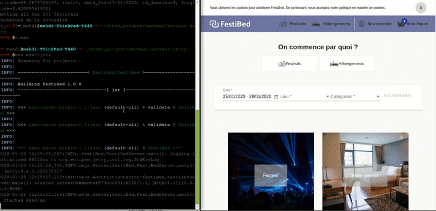

# Goupe 7
 - Do, Hanh
 - Cissé, Drissa
 - Mendes, Julien
 - Khadir, Mehdi

# Spring fonctionnel
### Premier [24/01/2019]


 - ✔ Affichage des Festivals /festivals
 - ⏳ Recherche d'un Festival [en cours]

# SGBD Oracle
Le SGBD Oracle est installer dans un serveur distant sous **Docker**

```
hostname: festibed.khadir.net
port: 1521
sid: xe
username: system
password: GgQ3sGCe
```
Voir la capture pour la configuration avec **Dbeaver**.


##### Connect to Tomcat Manager with following settings:

```
http://festibed.khadir.net:8181/manager
user: admin
password: GgQ3sGCe
```


##### Connect to Oracle Application Express web management console via ORDS with following settings:
```
http://festibed.khadir.net:8181/ords/apex
workspace: internal
user: admin
password: GgQ3sGCe%NEW
```

## Données CSV -> Oracle
Les données sont disponible dan l'instance **FESTIBED**
Le traitement des données des CSV ont étaient transformer sous R.

Voir le dossier **data** pour plus de détails.


# Serveur Java
Utilisez MAVEN pour compiler puis pour exécuter le serveur jetty.

``` shell
cd serveur-jetty
```
## Fix MVN <> Orale sous **LINUX**
Ce fix marche uniquement sous la version 8 de Java.

```shell
mvn install:install-file -Dfile=ojdbc8.jar -DgroupId=com.oracle -DartifactId=ojdbc8 -Dversion=19.3 -Dpackaging=jar
```
Plus de détails sur : [How to add Oracle JDBC driver in your Maven local repository](https://mkyong.com/maven/how-to-add-oracle-jdbc-driver-in-your-maven-local-repository/)

```shell
mvn compile
mvn exec:java &
```

Kill old processus for server

``` shell
ps -aux | grep maven
```

# Client Web Angular
Installation des dépendances
```shell
cd client
npm install
ou
yarn install
```
Lancement du client

```shell
npm ng
ou
yarn ng
```

## Lancement du client
Configuration, pm2 nginx, reverse domaine named
```shell
pm2 start npm --name "festibed" -- ng serve
```

# Serveur Firebase
En cours

# Service de localisation
En cours

# Linux
Droplet Ubuntu 16.04.6 [DigitalOcean] le SGBD, le Serveur Java et le Client Angular

```shell
root@ubuntu-s-1vcpu-2gb-fra1-01:~# sudo apt install openjdk-8-jdk
root@ubuntu-s-1vcpu-2gb-fra1-01:~# sudo apt install --fix-missing
root@ubuntu-s-1vcpu-2gb-fra1-01:~# sudo apt upgrade
root@ubuntu-s-1vcpu-2gb-fra1-01:~# sudo apt install openjdk-8-jdk
root@ubuntu-s-1vcpu-2gb-fra1-01:~# java -version
openjdk version "1.8.0_232"
OpenJDK Runtime Environment (build 1.8.0_232-8u232-b09-0ubuntu1~16.04.1-b09)
OpenJDK 64-Bit Server VM (build 25.232-b09, mixed mode)
root@ubuntu-s-1vcpu-2gb-fra1-01:~# sudo apt install maven
root@ubuntu-s-1vcpu-2gb-fra1-01:~# sudo apt install maven
```
Install DOCKER
https://www.vultr.com/docs/installing-docker-ce-on-ubuntu-16-04

Open ports | ufw disable / enable
```shell
root@ubuntu-s-1vcpu-2gb-fra1-01:~# sudo ufw allow 8090/tcp
/*serveur Java*/
root@ubuntu-s-1vcpu-2gb-fra1-01:~# sudo ufw allow 4900/tcp
/*Angular*/
root@ubuntu-s-1vcpu-2gb-fra1-01:~# sudo ufw allow 1521/tcp
/*oracle port*/
root@ubuntu-s-1vcpu-2gb-fra1-01:~# sudo ufw allow 49160/tcp
/*docker oracle ssh*/
root@ubuntu-s-1vcpu-2gb-fra1-01:~# sudo ufw allow 8181/tcp
/*Tomcat*/
```

Install node, npm
```bash
sudo apt-get install curl software-properties-common
curl -sL https://deb.nodesource.com/setup_10.x | sudo bash -
apt-get install -y nodejs
nodejs -v
```

Install Yarn
https://yarnpkg.com/lang/en/docs/install/#debian-stable

```bash
curl -sS https://dl.yarnpkg.com/debian/pubkey.gpg | apt-key add -
echo "deb https://dl.yarnpkg.com/debian/ stable main" | tee /etc/apt/sources.list.d/yarn.list
apt-get install yarn
```

Installation de PM2
```shell
npm install pm2 -g
```

installation des dépendances et lancement du serveur SSR
```shell
pm2 start yarn --name "festibed" -- ng
```
